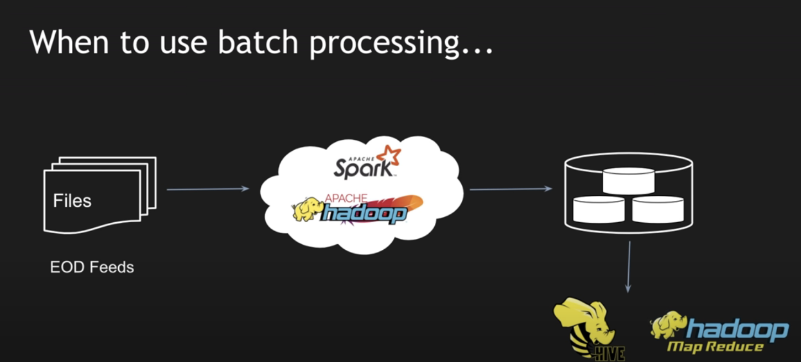
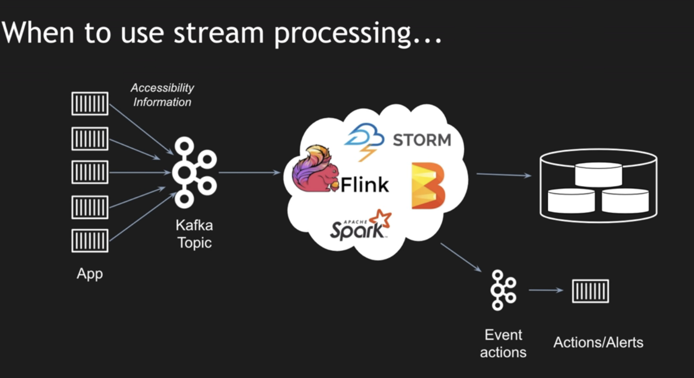

# Tech stack comparision

## 1. Hadoop vs spark

- **Hadoop**:
	- **Performance**: slow (write to disk) no real time
	- **Cost**: cheap, free
	- **Fault tolerant**: high with mutliple replicate
	- **Process**: process data in batch, using **mapReduce**.

- **Spark**:
	- **Performance**: fast (in-mem) 
	- **Cost**: expensive (required more ram)
	- **Fault tolerant**: using resilence datasets
	- **Process**: process data in realtime

## 2. Stream vs batch

- **Batch**:
	- **Use case**: data comming infrequently.

- **Stream**:
	- **Use case**: data comming in real time, for checking abnomaly
	

