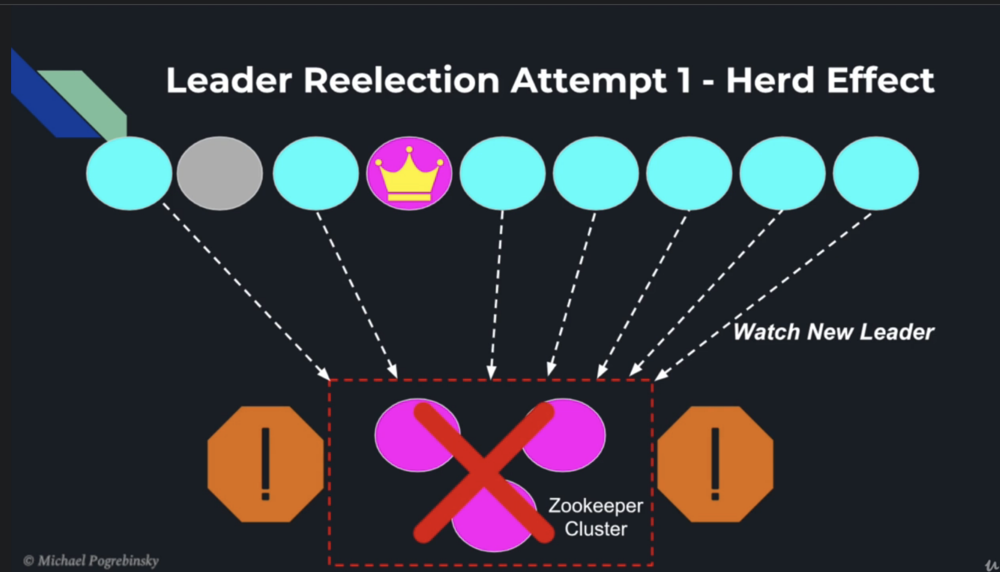

# Distributed System

## 1. Cluster coordination and distributed algorithm

> When there is an huge amount of data need to process, a cluster of computing unit is used for processing.
> 
> Distribute tasks and coordination is belong to a master node, however if master node dies, the whole system decommission along with it.
> 
> Because of that reasons, nodes have a mechanism to elect a master node in case when it die.

**Some command line:**

```powershell
# create zNode
create /parent "some data"

```
**Election Process**

- When a node die, it send notification to zoo keepers, each node have to elect new leader.

**The herd effect**

- When a notification occur, zookeeper is bombard with request make it freeze and unresponsive.



