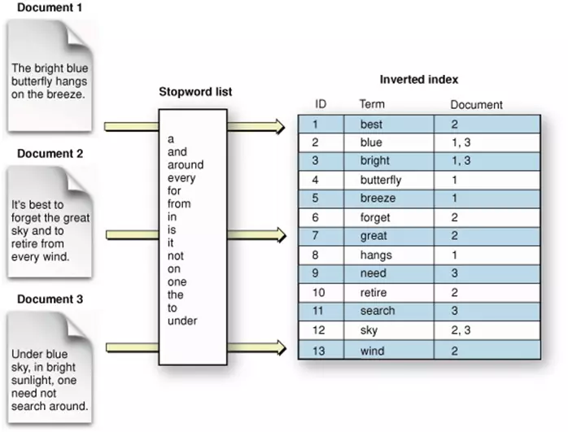

# Elastic Search

## 1. Introduce

Elasic search functionality:

- Search engine
- Store log for analysis
- Time series database
- Search autosuggestion

Advantage:

- Real time: after one seconds the record is searchable
- Schemaless: which is flexible to insert data
- Distributed
- Multi tenancy

Disadvantage:

- Chance of lost data

> Elasticsearch is a document-oriented NoSQL database, which is used to store data in the form of document. It allows the users to store, analyze, and search a large amount of data. Elasticsearch is one of the major products of ELK stack along with Logstash, Kibana, and Beats.




ES vs MongoDB

> If your use case is full text search only, I will still be more inclined towards Elasticsearch as it is designed for the same. I admit however that I haven't explored Mongodb capabilities in this regard. Elasticsearch provides various search paths **fuzzy, proximity matches, match phrases** and more which can be used depending on your use case.
> 
> One another difference between Elastic and Mongo's data storage is that Elastic keeps everything in memory while Mongo balances between disk and memory. So ideally Elastic should be faster if you load test it.
> 
> In terms of your test, please make sure that both mongo and elastic clusters are of equivalent strength in terms of resources. Else it is not apple to apple comparison.
> 


## 2. Installation

``` powershell
docker pull docker.elastic.co/elasticsearch/elasticsearch:8.4.3
docker network create elastic
docker run --name es01 --net elastic -p 9200:9200 -p 9300:9300 -it docker.elastic.co/elasticsearch/elasticsearch:8.4.3
docker exec -it es01 /usr/share/elasticsearch/bin/elasticsearch-reset-password -u elastic
docker cp es01:/usr/share/elasticsearch/config/certs/http_ca.crt .
curl --cacert http_ca.crt -u elastic https://localhost:9200


ENROLLMENT_TOKEN= eyJ2ZXIiOiI4LjQuMyIsImFkciI6WyIxNzIuMTkuMC4yOjkyMDAiXSwiZmdyIjoiNGY1MzIwZDNjNTNhMWEzOGFmNmE4ZDJiNTliNmRmZGMzZmM0MjM3NmViNDlmMzIzODU1ZWEzZDIyMzQ3MzQyYSIsImtleSI6InJVQ2ZQb1FCTVJuQlBwQVA1RzB5OjdpNVNUa1JoUjctUnhPdlZveDZYcUEifQ==

PASSWORD=rHv7tDmbtDnWGvlUYXwH
```

## 3. API

Send to index

``` curl
curl --cacert http_ca.crt -u elastic -X POST 'https://localhost:9200/logs/my_app' -H 'Content-Type: application/json' -d'
{
	"timestamp": "2018-01-24 12:34:56",
	"message": "User logged in",
	"user_id": 4,
	"admin": false
}'
```

