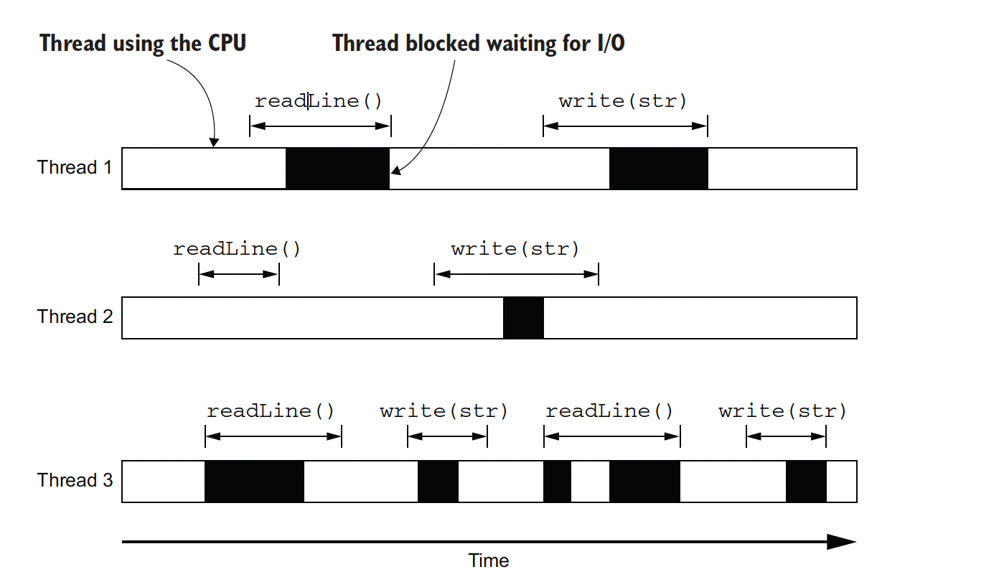
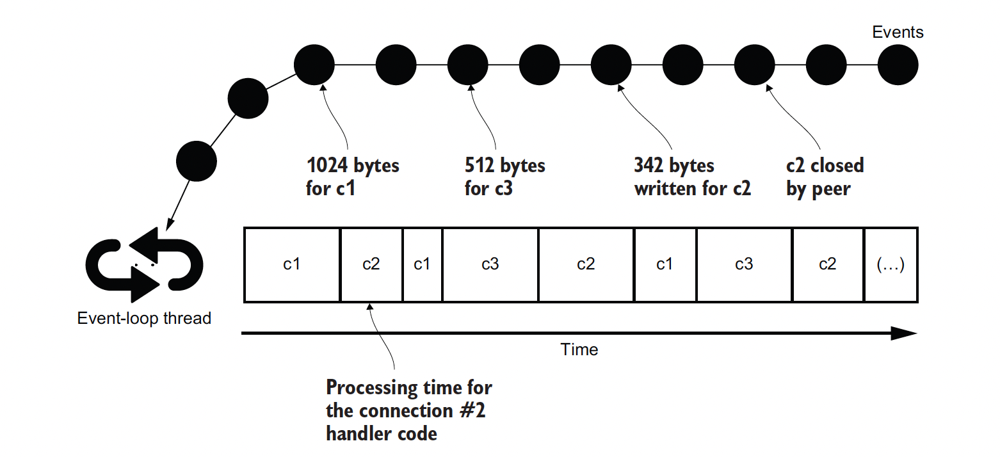
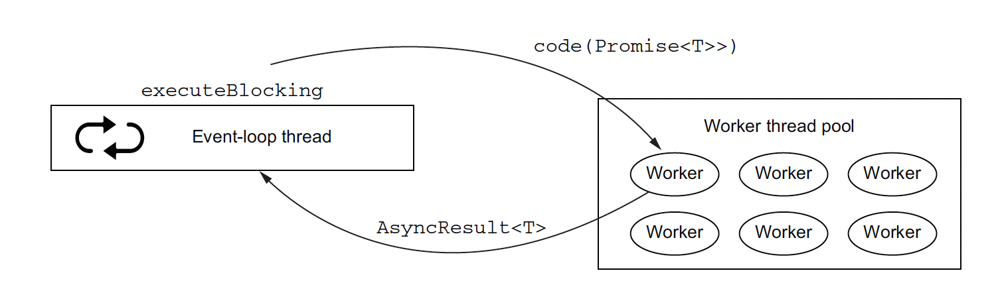
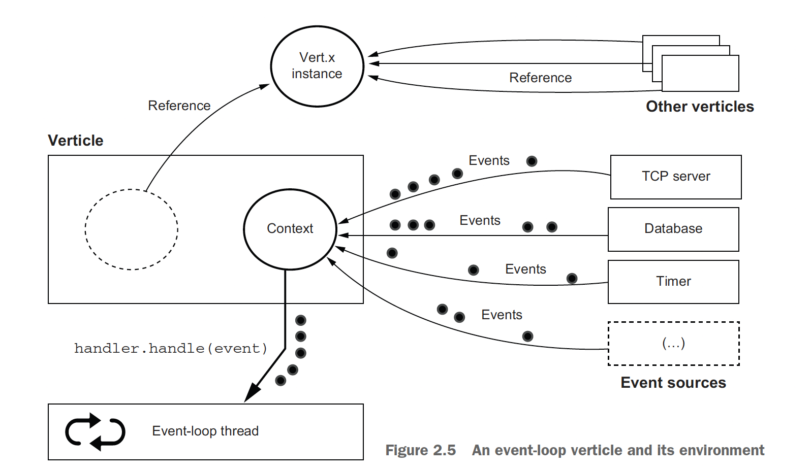
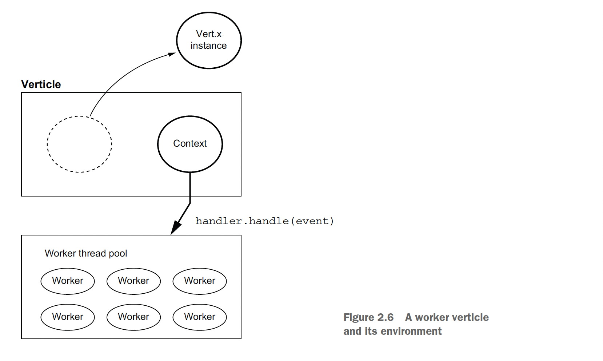
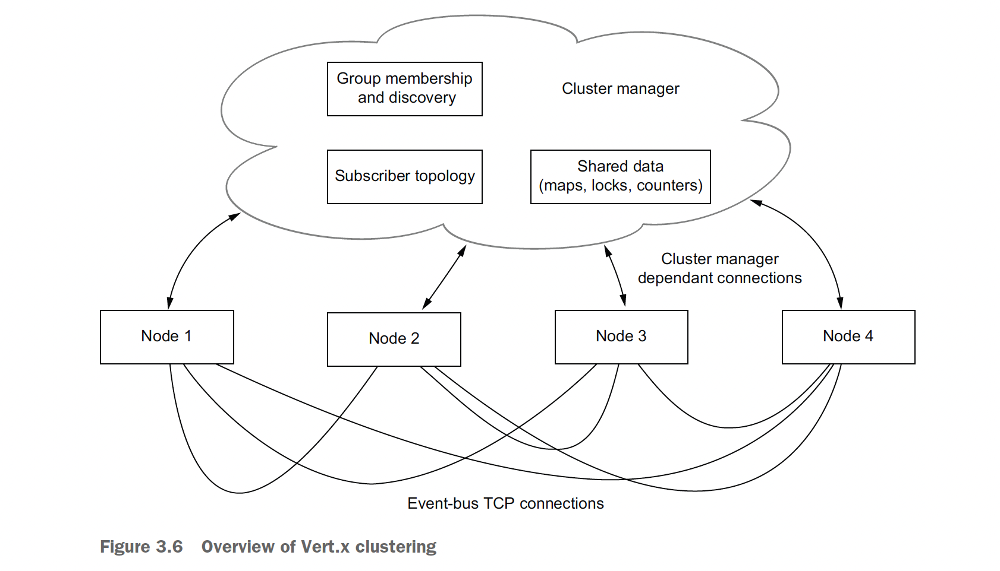
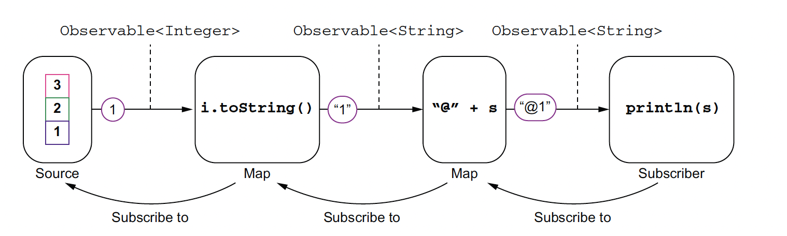

# Vert X

## 1. Async Code

### 1.1 The simplicity of blocking APIs

- Services need to manage connections to other services and requesters. The traditional and widespread model for managing concurrent network connections is to allocate a
**thread for each connection**. 

- This is the model in many technologies, such as Servlets
in Jakarta EE (before additions in version 3), Spring Framework (before additions in version 5), Ruby on Rails, Python Flask, and many more. This model has the advantage of simplicity, as it is synchronous.

### 1.2 Blocking APIs waste resources, increase costs

- In sync code write and read may waste time:
	- A read operation may be waiting for data to arrive from the network.
	- A write operation may have to wait for buffers to be drained if they are full from a previous write operation.




### 1.3 Asynchronous programming with non-blocking I/O

### 1.4 Multiplexing event-driven processing: The case of the event loop

- A popular threading model for processing asynchronous events is that of the event loop. Instead of polling for events that may have arrived, as we did in the previous Java NIO example, events are pushed to an event loop.




- In this model, each thread is assigned one evet loop, processing incoming event should not be blocked or it defeat the purpose of asynchrous code.

- In essence, event loop just a map between incoming events and its handlers

```java
public class EventLoop {
  private final ConcurrentLinkedDeque<Event> events = 
  new ConcurrentLinkedDeque<>();
  private final ConcurrentHashMap<String, Consumer<Object>> handlers = 
  new ConcurrentHashMap<>();

  public EventLoop on(String key, Consumer<Object> handler) {
    handlers.put(key, handler);
    return this;
  }

  public void dispatch(Event event) {
    events.add(event);
  }

  public void run() {
    while (!(events.isEmpty() && Thread.interrupted())) {
      if (!events.isEmpty()) {
        Event event = events.pop();
        if (handlers.containsKey(event.key)) {
          handlers.get(event.key).accept(event.data);
        } else {
          System.err.println("No handler for key " + event.key);
        }
      }
    }
  }
}
```

# 2. Verticles the basic unit of processing of vertx

## 2.1 When Code need to blocked

- Worker verticles are a special form of verticles that do not execute on an event loop. Instead, they execute on worker threads, that is, threads taken from special worker pools.

- The executeBlocking operation



## 2.2 Verticles enviroment

- The Vert.x instance is being shared by multiple verticles, and there is generally only one instance of Vertx per JVM process

- The context instance holds the access to the thread for executing handlers.

- User defined call back is executed via vert x context instance, vertx context instance pass handler to event loop and also allow us the register callback.





- In case of worker verticles it also not very different, but instead of calling to event loop, it passes handler to worker pool.



- Context class:

```java
private static void dataAndExceptions() {
    Vertx vertx = Vertx.vertx();
    Context ctx = vertx.getOrCreateContext();
    ctx.put("foo", "bar");

    ctx.exceptionHandler(t -> {
      if ("Tada".equals(t.getMessage())) {
        logger.info("Got a _Tada_ exception");
      } else {
        logger.error("Woops", t);
      }
    });

    ctx.runOnContext(v -> {
      throw new RuntimeException("Tada");
    });

    ctx.runOnContext(v -> {
      logger.info("foo = {}", (String) ctx.get("foo"));
    });
  }

```

# 3. Event bus: The backbone of a Vert.x application


- Event type in vert x:
	- Point to point
	- Request reply messeaging
	- Pub sub

**Clustering and the distributed event bus**




**From event bus to distributed event bus**

```java
  public static void main(String[] args) {
    Vertx.clusteredVertx(new VertxOptions(), ar -> {
      if (ar.succeeded()) {
        logger.info("First instance has been started");
        Vertx vertx = ar.result();
        vertx.deployVerticle("chapter3.HeatSensor", new DeploymentOptions().setInstances(4));
        vertx.deployVerticle("chapter3.HttpServer");
      } else {
        logger.error("Could not start", ar.cause());
      }
    });
  }
```

# 4. Asynchronous data and event streams

# 5. Beyond callbacks

## 5.1 Futures and promises

	- A promise is used to write an eventual value
	- And a future is used to read it when it is available. 
	- Let’s now see how it works in Vert.x.


**Interoperability with CompletionStage APIs**

```java
CompletionStage<String> cs = promise.future().toCompletionStage();
    cs
      .thenApply(String::toUpperCase)
      .thenApply(str -> "~~~ " + str)
      .whenComplete((str, err) -> {
        if (err == null) {
          System.out.println(str);
        } else {
          System.out.println("Oh... " + err.getMessage());
        }
      });
```

## 5.2 Obeservable pattern (RxJava)

- Reactive extensions are defined by three things:
	-  Observe data stream 
	-  Compose to other stream
	-  Subcribe to stream and react





> You may sometimes read about hot and cold sources. A hot source is a source where events are being emitted whether there are subscribers or not. A cold source is a source where events only start being emitted after the first subscription. A periodic timer is a hot source, whereas a file to read is a cold source. With a cold source, you can get all events, but with a hot source, you will only get those emitted after you have subscribed.


