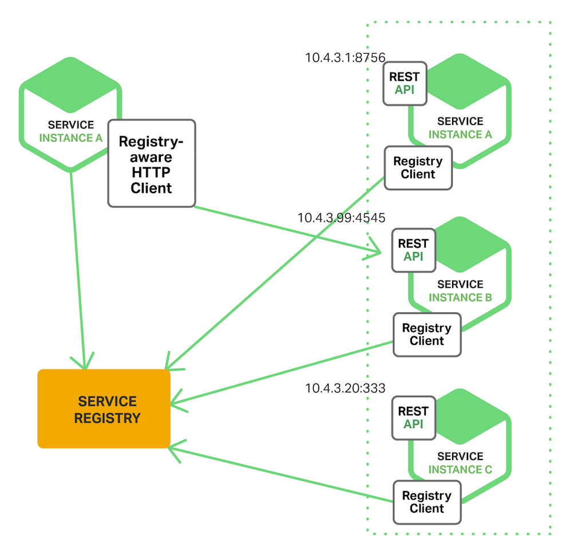

# Chapter 4 Vert X and Microservice pattern

## 4.1 Service Discovery

### 4.1.1 Overall pattern

**The problems without service discovery**


**Resolve with service discovery (client side)**



**Resolve with service discovery (server side)**


- This component provides an infrastructure to publish and discover various resources, such as service proxies, **HTTP endpoints, data sources**…​ 

- These resources are called services. A service is a discoverable functionality. It can be qualified by its type, metadata, and location. 

- So a service can be a database, a service proxy, a HTTP endpoint and any other resource you can imagine as soon as you can describe it, discover it and interact with it.

- The service discovery implements the interactions defined in service-oriented computing. And to some extent, also provides the dynamic service-oriented computing interactions. So, applications can react to arrival and departure of services.

- A service provider can:

	- publish a service record

	- un-publish a published record

	- update the status of a published service (down, out of service…​)

- A service consumer can:
	- 1) lookup a service record matching their need, 
	- 2) retrieve the ServiceReference that give access to the service, 
	- 3) get a service object to access the service, 
	- 4) release the service object once done.


Overall concept:

- Service records: infomatation shared between publisher and consumer
- Service Provider and publisher
- Service Consumer

### 4.1.2 Code


## 4.2 Circuit breaker
### 4.2.1 Overall pattern

**The circuit breaker pattern:**

```
The basic idea behind the circuit breaker is very simple. You wrap a protected
function call in a circuit breaker object, which monitors for failures. Once 
the failures reach a certain threshold. 

The circuit breaker trips, and all further calls to the circuit breaker return
with an error, without the protected call being made at all. Usually you'll 
also want some kind of monitor alert if the circuit breaker trips.
```


Using the circuit breaker to use the circuit breaker you need to:

Create a circuit breaker, with the configuration you want (timeout, number of failure before opening the circuit)

Execute some code using the breaker


```java
CircuitBreaker breaker = CircuitBreaker.create("my-circuit-breaker", vertx,
    new CircuitBreakerOptions().setMaxFailures(5).setTimeout(2000)
);

// ---
// Store the circuit breaker in a field and access it as follows
// ---

breaker.<String>execute(promise -> {
  vertx.createHttpClient().request(HttpMethod.GET, 8080, "localhost", "/")
    .compose(req -> req
      .send()
      .compose(resp -> {
        if (resp.statusCode() != 200) {
          return Future.failedFuture("HTTP error");
        } else {
          return resp.body().map(Buffer::toString);
        }
      })).onComplete(promise);
}).onComplete(ar -> {
  // Do something with the result
});

// Alternatively run with fallback

breaker.executeWithFallback(
    promise -> {
      vertx.createHttpClient().request(HttpMethod.GET, 8080, "localhost", "/")
        .compose(req -> req
          .send()
          .compose(resp -> {
            if (resp.statusCode() != 200) {
              return Future.failedFuture("HTTP error");
            } else {
              return resp.body().map(Buffer::toString);
            }
          })).onComplete(promise);
      }, v -> {
      // Executed when the circuit is opened
      return "Hello";
    })
    .onComplete(ar -> {
      // Do something with the result
    });

```

**Retries**

You can also specify how often the circuit breaker should try your code before failing with **setMaxRetries**. 

If you set this to something higher than 0 your code gets executed several times before finally failing in the last execution. If the code succeeded in one of the retries your handler gets notified and any retries left are skipped. Retries are only supported when the circuit is closed.

Notice that if you set maxRetries to 2 for instance, your operation may be called 3 times: the initial attempt and 2 retries.

```java
CircuitBreaker breaker = CircuitBreaker.create("my-circuit-breaker", vertx,
  new CircuitBreakerOptions().setMaxFailures(5).setMaxRetries(5).setTimeout(2000)
).openHandler(v -> {
  System.out.println("Circuit opened");
}).closeHandler(v -> {
  System.out.println("Circuit closed");
}).retryPolicy(retryCount -> retryCount * 100L); 
// increase delay between retries

breaker.<String>execute(
  promise -> {
    vertx.createHttpClient().request(HttpMethod.GET, 8080, "localhost", "/")
      .compose(req -> req
        .send()
        .compose(resp -> {
          if (resp.statusCode() != 200) {
            return Future.failedFuture("HTTP error");
          } else {
            return resp.body().map(Buffer::toString);
          }
        })).onComplete(promise);
  });
```


**The half-open state**

When the circuit is "open", calls to the circuit breaker fail immediately, without any attempt to execute the real operation. 

After a suitable amount of time (configured from **setResetTimeout**
, the circuit breaker decides that the operation has a chance of succeeding, so it goes into the half-open state.

In this state, the next call to the circuit breaker is allowed to execute the dangerous operation. Should the call succeed, the circuit breaker resets and returns to the closed state, ready for more routine operation.


**Circuit breaker is open when**

- Throw future err
- Timeout
- Exception

When circuit trips you can execute callback method.

You have to wrap your code in a circuit breaker to execute.
